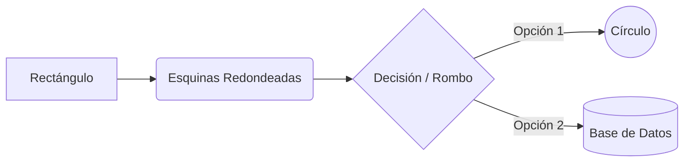
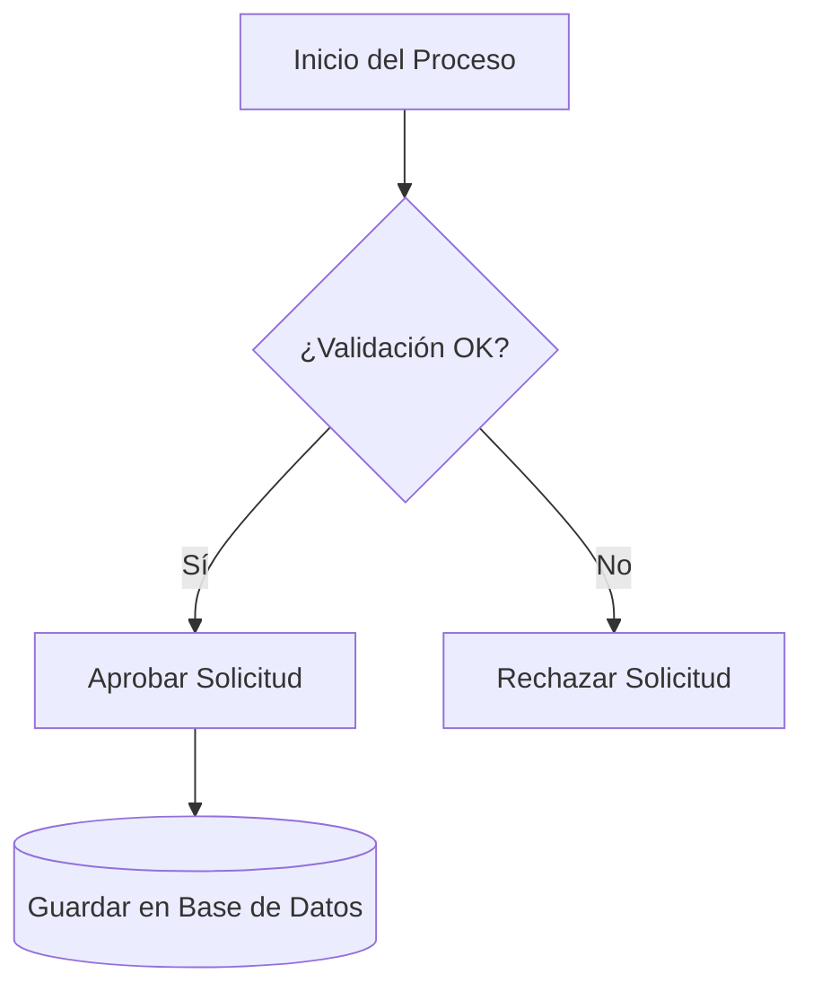
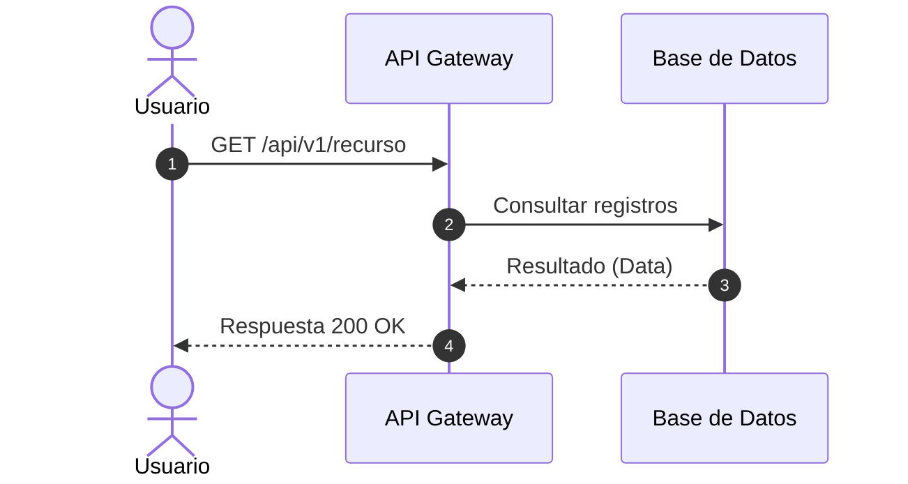
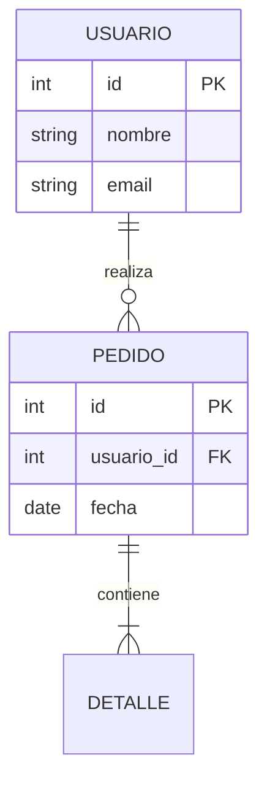
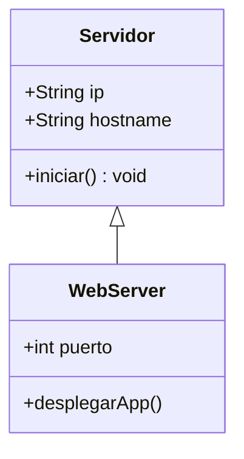
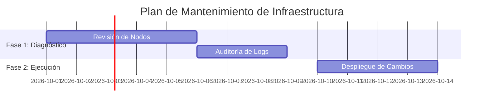
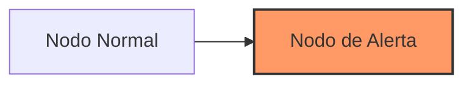

# 🧜‍♂️ Guía de Uso Básico de Mermaid.js

Mermaid.js te permite generar diagramas y visualizaciones utilizando código y texto plano en sintaxis Markdown.

---

## 🛠️ Estructura General

Para que cualquier plataforma (GitHub, GitLab, VS Code, Azure DevOps) renderice un gráfico de Mermaid, debes envolver el código dentro de un bloque etiquetado con `mermaid`:

```mermaid
[Sintaxis del gráfico]
```

---

## 1. 🔀 Diagramas de Flujo (Flowchart)

Declara la dirección del diagrama al inicio:
* `TD` / `TB`: Arriba hacia abajo (Top-Down / Top-Bottom)
* `LR`: Izquierda a derecha (Left-Right)
* `RL`: Derecha a izquierda (Right-Left)

### Formas de Nodos y Conectores



### Ejemplo



---

## 2. 🔄 Diagramas de Secuencia (Sequence Diagram)

Ideales para modelar la interacción entre sistemas, microservicios o usuarios a lo largo del tiempo.



---

## 3. 🗄️ Diagramas Entidad-Relación (ER Diagram)

Para representar modelos de datos relacionales y cardinalidad entre tablas.



---

## 4. 📐 Diagramas de Clases (Class Diagram)

Para diseño orientado a objetos y representación de clases o módulos de software.



---

## 5. 📅 Diagramas de Gantt (Gantt Chart)

Para la planificación visual de cronogramas y tareas de proyectos.



---

## 🎨 Personalización de Estilos Básicos

Puedes modificar colores y bordes de nodos específicos usando la propiedad `style`:


